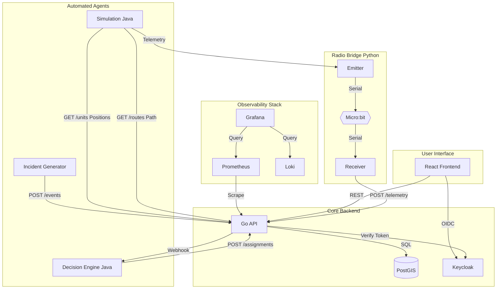
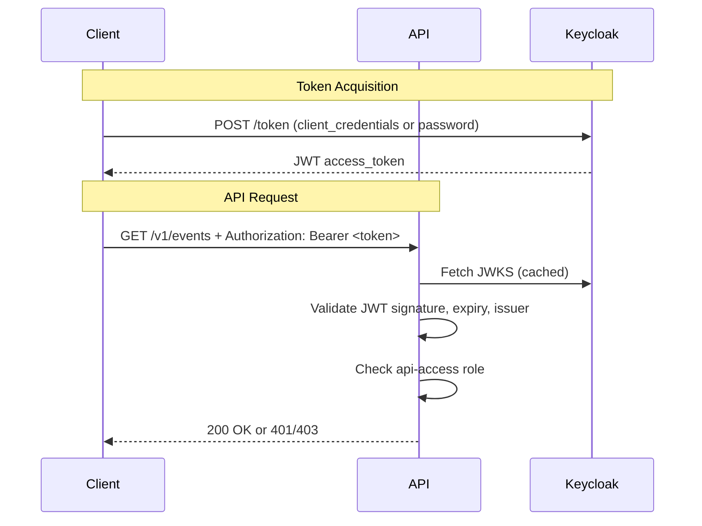
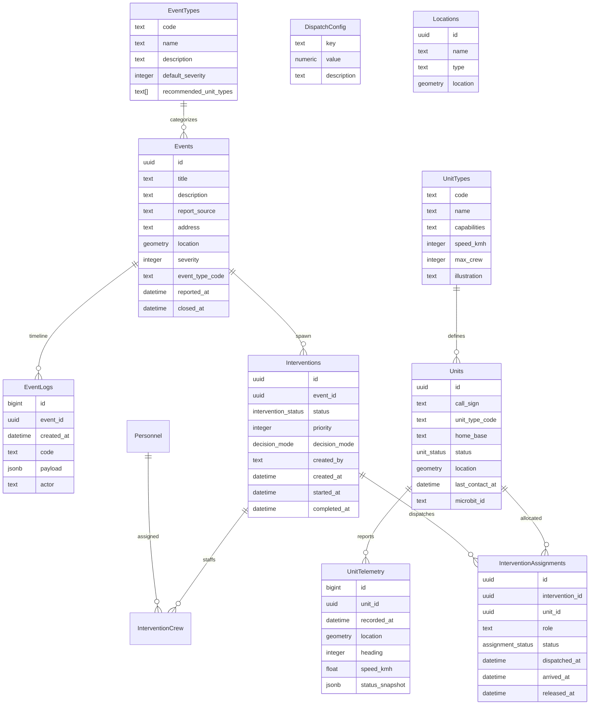

# Fast pin pom

## Useful Links

| Service        | URL                                               | Description                  |
| -------------- | ------------------------------------------------- | ---------------------------- |
| **Web UI**     | https://fast-pin-pon.4loop.org/                   | Main application interface   |
| **API**        | https://api.fast-pin-pon.4loop.org/               | Main API Endpoint            |
| **Swagger UI** | https://loan-mgt.github.io/fast-pin-pon/swagger   | API Contract & Documentation |
| **Keycloak**   | https://auth.fast-pin-pon.4loop.org/              | Identity Provider            |
| **Grafana**    | https://dash.fast-pin-pon.4loop.org/              | Metrics Dashboard            |
| **SonarQube**  | https://sonar.4loop.org/dashboard?id=fast-pin-pon | Code Quality Dashboard       |


## Architecture



## Project structure

The project is organized into microservices and components:

```
.
├── api/                # Main Backend (Go) - REST API, DB logic
├── engine/             # Decision Engine (Java) - Resource optimization
├── front/              # Frontend (React/Vite) - HQ Application
├── incidentCreation/   # Load Generator (Java) - Creates random incidents
├── network/            # Hardware Bridge (Python) - Radio/Serial communication
├── simulation/         # World Simulation (Java) - Vehicle movements
├── database/           # Database initialization & PostGIS config
├── infra/              # Infrastructure (Keycloak, Grafana, Prom, etc.)
└── .github/            # CI/CD workflows
```

## Components and Features

### Network (`network/`)

**IoT and Radio Frequency Communication Bridge**

This module implements a physical radio bridge using **Micro:bit** devices to process simulation data through a real "air gapped" radio link

#### Architecture Flow

1.  **Emitter Bridge (PC)** (`bridge_emitter.py`):
    - Polls the simulation HTTP endpoint.
    - Encapsulates data into a custom serial protocol (SEQ + CRC + Data).
    - Sends data via USB Serial to the **Unit Micro:bit**.
2.  **Unit Micro:bit** (`unit.py`):
    - Receives serial data from the Emitter Bridge.
    - Broadcasts the payload via **2.4GHz Radio**.
    - Allows manual status updates via hardware buttons (A/B).
3.  **Relay Micro:bit** (`relay.py`):
    - Listens for radio packets on the specific channel.
    - Relays received messages to the Receiver Bridge via USB Serial.
4.  **Receiver Bridge (Server)** (`bridge_receiver.py`):
    - Decodes the serial stream.
    - Validates data formats (`GPS`, `STA`).
    - Pushes updates to the Main API (`POST /v1/units/{id}/telemetry`).

#### Protocol & Security

- **Radio Channel**: 7 (Configurable)
- **Status Codes**: Optimized 3-char codes (`AVL`=Available, `UWY`=Underway, `ONS`=OnSite) to save bandwidth.
- **Packet Structure**: ASCII-based simple protocol (`TYPE:ID,PAYLOAD`).

#### Usage

```bash
# Start Emitter (Sim -> Serial)
SERIAL_PORT=/dev/ttyACM0 SIMULATOR_URL=http://localhost:8090 python3 bridge_emitter.py

# Start Receiver (Serial -> API)
SERIAL_PORT=/dev/ttyACM1 API_URL=http://localhost:8081 python3 bridge_receiver.py
```

### API (`api/`)

**Backend Services and REST API**

It handles business logic, persistence, and coordinates between the Decision Engine and the Frontend.

#### Tech Stack

- **Language**: Go
- **Router**: [`chi`](https://github.com/go-chi/chi) (Lightweight, idiomatic)
- **Database Access**: [`pgx`](https://github.com/jackc/pgx) driver with [`sqlc`](https://sqlc.dev/) for type-safe, generated SQL code.
- **Database**: PostgreSQL with **PostGIS** extension (spatial queries) and **pgRouting** (pathfinding).
- **Observability**: Prometheus metrics (`/metrics`) and structured JSON logging (`zerolog`).

#### Key Capability Domains

1.  **Event & Intervention Management**:
    - Full lifecycle management: Incident creation -> Intervention -> Assignments -> Resolution.
    - Tracks status changes and audit logs (`/v1/events/{id}/logs`).

2.  ** Fleet Management**:
    - Real-time unit tracking (CRUD, status, location updates).
    - Spatial queries: "Find units nearby" (`/v1/units/nearby`).
    - Hardware linking: Associate units with Micro:bit IDs (`/v1/units/{id}/microbit`).

3.  **Routing**:
    - Calculates optimal routes using **pgRouting**.
    - Stores and tracks unit progression along calculated paths.

### Simulation (`simulation/`)

**Vehicle Physics & World State (Java)**

This component bridges the gap between the static database state and the "real world" movement of vehicles. It runs a game loop to update vehicle positions along their assigned routes.

- **Mechanics**:
  - Runs a **1 Hz Game Loop** (1 tick/second) using a `ScheduledExecutorService`.
  - On each tick, it calculates the new position of every moving unit based on its speed and path.
- **Interfaces**:
  - **API Client**: Pushes updates to the Main API.
  - **HTTP Server** (Port 8090): Exposes a `/tick` endpoint polled by the **Network Bridge** to fetch "physical" coordinates for radio transmission.
- **Components**:
  - `SimulationEngine`: Main logic coordinator.
  - `RoutingService`: Interpolates positions along decoding Polyline paths.

### Decision Engine (`engine/`)

**Intelligent Dispatch System (Java)**

The "Brain" of the operation. It assigns the most appropriate resource to each intervention using a multi-objective optimization algorithm.

- **Trigger Modes**:
  - **Webhook**: Immediate calculation when API notifies of a new intervention (`POST /dispatch/assign`).
  - **Scheduler**: Periodically runs (every N seconds) to re-optimize pending interventions or reassign freed units.
- **Scoring Algorithm** (Lower is better):
    ```
    Score = (w1 * TravelTime) 
          + (w2 * CoveragePenalty) 
          + (w3 * CapabilityBonus) 
          + (w4 * PreemptionCost)
    ```
  - **Travel Time**: Estimated ETA from OSRM/pgRouting.
  - **Coverage**: Penalties for leaving a fire station below minimum reserve capacity.
  - **Preemption**: Can re-route units from low-priority tasks to high-priority emergencies (if `SeverityDelta > Threshold`).
- **Configuration**: Weights and coefficients are loaded from `DispatchConfig` to tune behavior without recompilation.

### Incident Generator (`incidentCreation/`)

**Load & Chaos Generator (Java)**

A standalone service designed to stimulate the system by generating random emergency events.

- **Use Case**: Used for load testing, demos, and ensuring the system always has active data flow during development.


### Keycloak Integration
The system uses **Keycloak** as the central authentication and authorization server. All applications (Grafana, SonarQube, API) are integrated with Keycloak using OpenID Connect (OIDC) protocol.

**Keycloak Configuration:**
- **Realm:** `sdmis-realm`
- **Port:** `8080`
- **Protocol:** OpenID Connect (OIDC)

### Role-Based Access Control (RBAC)
The system implements a **three-tier role hierarchy** to control access to different resources and dashboards:

| Role          | Access Level  | Permissions                                    |
| ------------- | ------------- | ---------------------------------------------- |
| **classic**   | Basic         | Access to **Map** view only                    |
| **superieur** | Intermediate  | Access to **Map** + **Dashboard**              |
| **it**        | Administrator | Full access: **Map** + **Dashboard** + **Log** |


### Authentication Flow



## Database




