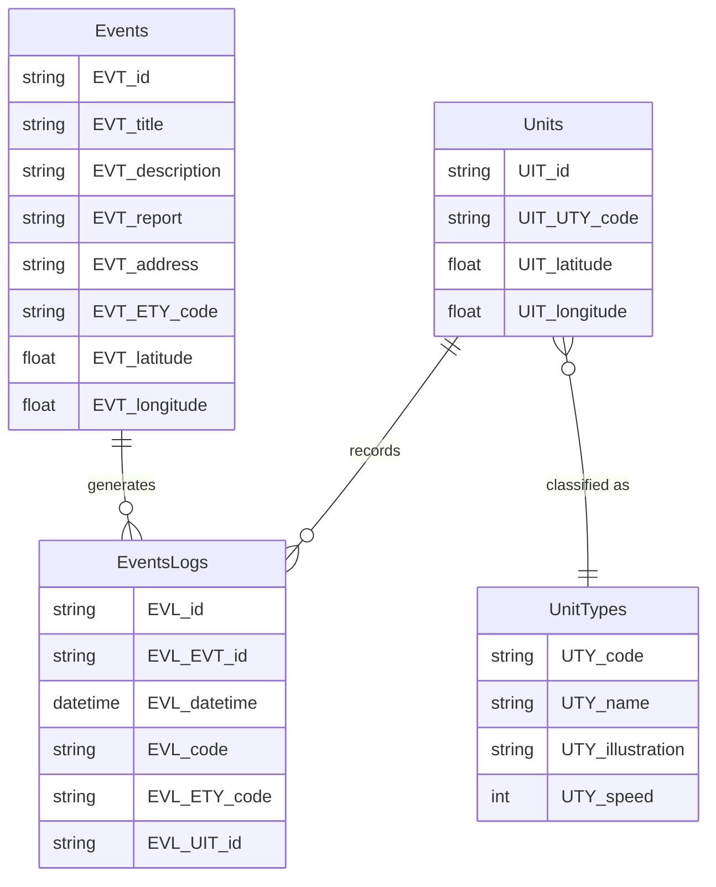

# Fast pin pom

A minimal project repository. This README contains a small project illustration and the recommended directory layout.

## Illustration


## Project structure

Please follow this file structure:

```
.
├─ .github/   # CI
├─ infra/     # infra config
├─ network/   # network definitions
├─ api/       # API code
└─ simu/      # simulators
```

## Components and Features

### Network (`network/`)

**IoT and Radio Frequency Communication**

- **Radio Network Infrastructure**
  - Microbit gateway (emitter) connected to simulation via serial
  - Microbit receiver (centralized) connected to datacenter
  - Serial communication between microbits and host machines

- **Communication Protocol**
  - Support various message types (GPS coordinates, intervention status, etc.)
  - Automatic periodic transmissions (e.g., GPS coordinates)
  - On-demand transmissions (e.g., end of intervention)
  - Reliable and robust communications (low sensitivity to packet loss, data coherence)

- **Security**
  - Data integrity verification
  - Message authenticity
  - Confidentiality of transmitted data
  - Encryption of radio communications

### API (`api/`)

**Backend Services and REST API**

- **HQ Application Backend**
  - Real-time incident tracking
  - Resource management (vehicles, personnel)
  - Intervention coordination
  - Decision-making engine for resource allocation (Java required)

- **Core Features**
  - Incident declaration and management
  - Intervention triggering and lifecycle
  - Automatic resource allocation suggestions based on:
    - Incident type
    - Distance to event location
    - Operational status (availability, functional state, resource gauges)
  - Manual override capability for operators

- **Data Integration**
  - External data sources (optional enhancements):
    - Weather events (critical weather conditions)
    - Road traffic (resource allocation, delays)
    - Incident history for post-analysis

- **Security & Authentication**
  - Keycloak authentication server integration
  - OWASP Top 10 best practices
  - Secure/encrypted API exchanges
  - Access control and restricted permissions

- **Real-time Communication**
  - Support for pull/push mechanisms (HTTP REST, SSE, WebSocket)
  - Optimized refresh rate for real-time data

### Simulation (`simu/`)

**Incident and Vehicle Simulation System (Java required)**

- **Incident Simulation**
  - Generate simulated incidents with:
    - Incident type
    - Location coordinates
    - Severity level
    - Timestamp
  - Incident evolution over time
  - Coherent transmission to HQ App

- **Vehicle Simulation**
  - Simulate vehicles, their location, and movements
  - GPS coordinate generation and updates
  - Vehicle status simulation (availability, operational state)
  - Terminal input simulation or test interface for operator input

- **Integration Modes**
  - Option 1: Dedicated simulation interface for operator monitoring
  - Option 2: Direct automated access to HQ App API (with clearly defined permissions)
  - Modular architecture for easy switch between simulation and real-world data

- **Testing & Validation**
  - Represent external system states and state changes
  - Validate end-to-end system functionality (capture, processing/decision, restitution)


## Database

### Events
- `EVT_id`
- `EVT_title`
- `EVT_description`
- `EVT_report`
- `EVT_address`
- `EVT_ETY_code`
- `EVT_latitude`
- `EVT_longitude`

### Events Logs
- `EVL_id`
- `EVL_EVT_id`
- `EVL_datetime`
- `EVL_code`
- `EVL_ETY_code`
- `EVL_UIT_id`

### Units
- `UIT_id`
- `UIT_UTY_code`
- `UIT_latitude`
- `UIT_longitude`

### Unit Types
- `UTY_code`
- `UTY_name`
- `UTY_illustration`
- `UTY_speed`




