# Fast Pin Pon

## Useful Links

| Service        | URL                                               | Description                  |
| -------------- | ------------------------------------------------- | ---------------------------- |
| **Web UI**     | https://fast-pin-pon.4loop.org/                   | Main application interface   |
| **API**        | https://api.fast-pin-pon.4loop.org/               | Main API Endpoint            |
| **Swagger UI** | https://loan-mgt.github.io/fast-pin-pon/swagger   | API Contract & Documentation |
| **Keycloak**   | https://auth.fast-pin-pon.4loop.org/              | Identity Provider            |
| **Grafana**    | https://dash.fast-pin-pon.4loop.org/              | Metrics Dashboard            |
| **SonarQube**  | https://sonar.4loop.org/dashboard?id=fast-pin-pon | Code Quality Dashboard       |


## Livrables du Projet

Documents techniques et fonctionnels générés pour le projet :

*   **[Spécifications Fonctionnelles Détaillées (SFD)](doc/Specifications_Fonctionnelles_Detaillees.md)** : Acteurs, Cas d'usage, Fonctionnalités.
*   **[Spécifications Techniques Générales (STG)](doc/Specifications_Techniques_Generales.md)** : Architecture, Stack technique, Schéma BDD.
*   **[Manuel de Déploiement](doc/Manuel_Deploiement.md)** : Guide d'installation, configuration Docker et Matériel.
*   **[Protection et Robustesse](doc/Protection_et_Robustesse.md)** : Sécurité (IAM, Radio) et résilience du système.
*   **[Manuel Utilisateur](doc/Manuel_Utilisateur.md)** : Guide d'utilisation de l'interface Web.
*   **[Monitoring](doc/Monitoring_doc.md)** : Stack monitoring (Prometheus, Grafana, Loki) et authentification Keycloak.

## Architecture


## Docker Infrastructure

The project involves tightly connected microservices. This diagram outlines the network boundaries and exposed ports.


## Project structure

The project is organized into microservices and components:

```
.
├── api/                # Main Backend (Go) - REST API, DB logic
├── engine/             # Decision Engine (Java) - Resource optimization
├── front/              # Frontend (React/Vite) - HQ Application
├── incidentCreation/   # Load Generator (Java) - Creates random incidents
├── network/            # Hardware Bridge (Python) - Radio/Serial communication
├── simulation/         # World Simulation (Java) - Vehicle movements
├── database/           # Database initialization & PostGIS config
├── infra/              # Infrastructure (Keycloak, Grafana, Prom, etc.)
└── .github/            # CI/CD workflows
```

## Configuration & Environment Variables

Key environment variables to control system behavior, adjustable in `docker-compose.dev.yml` or `.env`.

### Simulation Service (`simulation`)
| Variable                      | Default | Description                                                                                                                                                      |
| :---------------------------- | :------ | :--------------------------------------------------------------------------------------------------------------------------------------------------------------- |
| `SIMULATION_UPDATING_ENABLED` | `true`  | **Critical**: Controls whether the simulation updates unit positions. Set to `true` to enable movement and Microbit integration. Set to `false` to freeze units. |
| `SIMULATION_SPEED_MULTIPLIER` | `8.0`   | Speed factor. `1.0` is real-time. Higher values speed up vehicle movement.                                                                                       |

### Incident Generator (`incidentCreation`)
| Variable                    | Default | Description                                                         |
| :-------------------------- | :------ | :------------------------------------------------------------------ |
| `INCIDENT_INTERVAL_SECONDS` | `180`   | Time (in seconds) between automatically generated random incidents. |

### Decision Engine (`engine`)
| Variable                     | Default | Description                                                    |
| :--------------------------- | :------ | :------------------------------------------------------------- |
| `DISPATCH_SCHEDULER_ENABLED` | `true`  | Enables the periodic dispatch loop to re-optimize assignments. |
| `DISPATCH_INTERVAL_SECONDS`  | `30`    | Frequency (in seconds) of the dispatch optimization loop.      |

## Components and Features

### Network (`network/`)

**IoT and Radio Frequency Communication Bridge**

This module implements a physical radio bridge using **Micro:bit** devices to process simulation data through a real "air gapped" radio link

#### Architecture Flow


1.  **Emitter Bridge (PC)** (`bridge_emitter.py`):
    - Polls the simulation HTTP endpoint.
    - Encrypts and encapsulates data (SEQ + XOR Encrypted Data + CRC + Sign).
    - Sends data via USB Serial to the **Unit Micro:bit**.
2.  **Unit Micro:bit** (`unit.py`):
    - Receives serial data from the Emitter Bridge.
    - Broadcasts the payload via **2.4GHz Radio**.
    - Allows manual status updates via hardware buttons (A/B).
3.  **Relay Micro:bit** (`relay.py`):
    - Listens for radio packets on the specific channel.
    - Relays received messages to the Receiver Bridge via USB Serial.
4.  **Receiver Bridge (Server)** (`bridge_receiver.py`):
    - Decodes the serial stream.
    - Validates integrity (CRC + Signature) and decrypts payload.
    - Pushes updates to the Main API (`POST /v1/units/{id}/telemetry`).

#### Protocol & Security

- **Radio Channel**: 7 (Configurable)
- **Encryption**: Lightweight XOR encryption with shared secret key.
- **Integrity & Auth**: Custom Signature (Salted) + CRC8 checksum to ensure authenticity.
- **Packet Structure**: `SEQ|ENCRYPTED_DATA|CRC|SIGN`

#### Usage

```bash
# Start Emitter (Sim -> Serial)
SERIAL_PORT=/dev/ttyACM0 SIMULATOR_URL=http://localhost:8090 python3 bridge_emitter.py

# Start Receiver (Serial -> API)
SERIAL_PORT=/dev/ttyACM1 API_URL=http://localhost:8081 python3 bridge_receiver.py
```

#### Guide d'Installation Hardware

Ce guide détaille les étapes pour mettre en place la communication radio "air-gapped" entre le simulateur et l'API.

**Prérequis**
- Python 3.8+
- 2x cartes Micro:bit v2
- Câbles Micro-USB

**1. Installation des dépendances**
Sur les deux machines (PC Emetteur et PC Récepteur) :
```bash
cd network
pip install -r requirements.txt
# Note: Le script utilise un chargeur .env interne, pas besoin de python-dotenv
```

**2. Flashage des Micro:bits**
Rendez-vous sur [Python Editor for Micro:bit](https://python.microbit.org/v3).

*   **Micro:bit "UNIT" (Mobile / Emetteur)**
    1.  Copiez le contenu de `network/unit.py`.
    2.  Flashez le code sur la première carte.
    3.  Au démarrage, elle affiche une coche (✓) puis son ID (ex: `MB001`).

*   **Micro:bit "RELAY" (Station / Récepteur)**
    1.  Copiez le contenu de `network/relay.py`.
    2.  Flashez le code sur la seconde carte.
    3.  Au démarrage, elle affiche une flèche Ouest (←).

**3. Configuration**
Créez un fichier `.env` dans le dossier `network/` (ou définissez les variables d'environnement) :

```ini
# Configuration Commune
KEYCLOAK_URL=https://auth.fast-pin-pon.4loop.org
KEYCLOAK_REALM=sdmis-realm
KEYCLOAK_CLIENT_ID=bridge-client
KEYCLOAK_CLIENT_SECRET=votre-secret

# PC 1 : Emetteur (Simulateur -> Micro:bit)
SIMULATOR_URL=http://localhost:8090
SERIAL_PORT=/dev/tty.usbmodemXXXX  # Adaptez selon votre OS (ex: COM3 sur Windows)

# PC 2 : Récepteur (Micro:bit -> API)
API_URL=http://localhost:8081
# SERIAL_PORT=... (Si différent)
```

**4. Lancement**

*   **Sur le PC Emetteur (Simulateur)** :
    ```bash
    # Lance le bridge qui lit le simulateur et écrit sur le port série
    python3 bridge_emitter.py
    ```
    *Vérification : Le terminal doit afficher `[EMIT] GPS:...` et la Micro:bit doit clignoter.*

*   **Sur le PC Récepteur (API)** :
    ```bash
    # Lance le bridge qui lit le port série et notifie l'API
    python3 bridge_receiver.py
    ```
    *Vérification : Le terminal doit afficher `[RECV] ...` et `[API] Location updated`.*

### API (`api/`)

**Backend Services and REST API**

It handles business logic, persistence, and coordinates between the Decision Engine and the Frontend.

#### Tech Stack

- **Language**: Go
- **Router**: [`chi`](https://github.com/go-chi/chi) (Lightweight, idiomatic)
- **Database Access**: [`pgx`](https://github.com/jackc/pgx) driver with [`sqlc`](https://sqlc.dev/) for type-safe, generated SQL code.
- **Database**: PostgreSQL with **PostGIS** extension (spatial queries) and **pgRouting** (pathfinding).
- **Observability**: Prometheus metrics (`/metrics`) and structured JSON logging (`zerolog`).

#### Key Capability Domains

1.  **Event & Intervention Management**:
    - Full lifecycle management: Incident creation -> Intervention -> Assignments -> Resolution.
    - Tracks status changes and audit logs (`/v1/events/{id}/logs`).

2.  **Fleet Management**:
    - Real-time unit tracking (CRUD, status, location updates).
    - Spatial queries: "Find units nearby" (`/v1/units/nearby`).
    - Hardware linking: Associate units with Micro:bit IDs (`/v1/units/{id}/microbit`).

3.  **Routing**:
    - Calculates optimal routes using **pgRouting**.
    - Stores and tracks unit progression along calculated paths.

### Simulation (`simulation/`)

**Vehicle Physics & World State (Java)**

This component bridges the gap between the static database state and the "real world" movement of vehicles. It runs a game loop to update vehicle positions along their assigned routes.

- **Mechanics**:
  - Runs a **1 Hz Game Loop** (1 tick/second) using a `ScheduledExecutorService`.
  - On each tick, it calculates the new position of every moving unit based on its speed and path.
- **Interfaces**:
  - **API Client**: Pushes updates to the Main API.
  - **HTTP Server** (Port 8090): Exposes a `/tick` endpoint polled by the **Network Bridge** to fetch "physical" coordinates for radio transmission.
- **Components**:
  - `SimulationEngine`: Main logic coordinator.
  - `RoutingService`: Interpolates positions along decoding Polyline paths.

### Decision Engine (`engine/`)

**Intelligent Dispatch System (Java)**

The "Brain" of the operation. It assigns the most appropriate resource to each intervention using a multi-objective optimization algorithm.

- **Trigger Modes**:
  - **Webhook**: Immediate calculation when API notifies of a new intervention (`POST /dispatch/assign`).
  - **Scheduler**: Periodically runs (every N seconds) to re-optimize pending interventions or reassign freed units.
- **Scoring Algorithm** (Lower is better):
    ```
    Score = (w1 * TravelTime) 
          + (w2 * CoveragePenalty) 
          + (w3 * CapabilityBonus) 
          + (w4 * PreemptionCost)
    ```
  - **Travel Time**: Estimated ETA from OSRM/pgRouting.
  - **Coverage**: Penalties for leaving a fire station below minimum reserve capacity.
  - **Preemption**: Can re-route units from low-priority tasks to high-priority emergencies (if `SeverityDelta > Threshold`).
- **Configuration**: Weights and coefficients are loaded from `DispatchConfig` to tune behavior without recompilation.

### Incident Generator (`incidentCreation/`)

```mermaid
sequenceDiagram
    participant IC as 🚨 Incident Creation
    participant API as ⚡ API
    participant DB as 💾 PostgreSQL
    participant Engine as 🚒 Engine
    participant Sim as 📍 Simulation
    participant Grafana as 📊 Grafana
    
    Note over IC: Toutes les 3 minutes
    IC->>API: POST /v1/incidents<br/>(nouvel incident)
    API->>DB: INSERT incident
    DB->>API: incident_id
    API->>IC: 201 Created
    
    Note over Engine: Polling toutes les 30s
    Engine->>API: GET /v1/incidents?status=pending
    API->>DB: SELECT incidents
    DB->>API: Liste incidents
    API->>Engine: Incidents non assignés
    
    Engine->>Engine: Calcule dispatch optimal
    Engine->>API: POST /v1/dispatch<br/>(assign vehicles)
    API->>DB: UPDATE incidents, vehicles
    DB->>API: Success
    API->>Engine: 200 OK
    
    Note over Sim: Temps réel
    Sim->>API: PUT /v1/vehicles/{id}/position
    API->>DB: UPDATE vehicle position
    API->>Sim: 200 OK
    
    Note over Grafana: Dashboard temps réel
    Grafana->>API: GET /v1/metrics
    API->>DB: Aggregate data
    DB->>API: Stats
    API->>Grafana: Metrics JSON
```


---
**Load & Chaos Generator (Java)**

A standalone service designed to stimulate the system by generating random emergency events.

- **Use Case**: Used for load testing, demos, and ensuring the system always has active data flow during development.


### Keycloak Integration
The system uses **Keycloak** as the central authentication and authorization server. All applications (Grafana, SonarQube, API) are integrated with Keycloak using OpenID Connect (OIDC) protocol.

**Keycloak Configuration:**
- **Realm:** `sdmis-realm`
- **Port:** `8080`
- **Protocol:** OpenID Connect (OIDC)

### Role-Based Access Control (RBAC)
The system implements a **three-tier role hierarchy** to control access to different resources and dashboards:

| Role          | Access Level  | Permissions                                    |
| ------------- | ------------- | ---------------------------------------------- |
| **classic**   | Basic         | Access to **Map** view only                    |
| **superieur** | Intermediate  | Access to **Map** + **Dashboard**              |
| **it**        | Administrator | Full access: **Map** + **Dashboard** + **Log** |

#### 1. Administrator (`it`)
The "admin" role intended for System Administrators and IT Operations.
- **Dashboard Access**: Full access to Grafana Dashboards, Logs (Loki), and SonarQube.
- **Map/Operational Access**: Can create/delete/modify **ALL** resources (Incidents, Units, Assignments).
- **Specific Capabilities**:
    - Create/Delete Units (Fleet Management).
    - Force delete incidents.
    - Full CRUD on events.

#### 2. Supervisor (`superieur`)
Intended for Operational Command Centers (CODIS) needing high-level overview and dispatch capabilities without system-level administration.
- **Dashboard Access**: Read-only access to operational metrics (Grafana).
- **Map/Operational Access**:
    - **Create Incidents**: Can declare new emergencies.
    - **Assign Units**: Can manually override dispatch decisions.
    - **Address Search**: Access to geocoding services.
- **Restrictions**: Cannot delete resources or modify fleet composition.

#### 3. Standard User (`classic`)
Default access for field personnel or public view.
- **Access**: Read-only Map View.
- **Capabilities**: Can view real-time unit positions and active incidents but cannot interact with them.

-----
### Authentication Flow

```mermaid
sequenceDiagram
    participant User as 👤 Utilisateur
    participant Front as 🖥️ Frontend
    participant API as ⚡ API
    participant Keycloak as 🔐 Keycloak
    
    User->>Front: Accède à l'application
    Front->>Keycloak: Redirect vers login<br/>(Authorization Code Flow)
    Keycloak->>User: Affiche formulaire login
    User->>Keycloak: Entre credentials
    Keycloak->>Front: Redirect avec authorization code
    Front->>Keycloak: POST /token<br/>(code + client_credentials)
    Keycloak->>Front: JWT access_token + refresh_token
    
    Note over Front: Stocke tokens
    
    Front->>API: GET /v1/events<br/>Authorization: Bearer <token>
    API->>Keycloak: Fetch JWKS (cached)
    API->>API: Valide signature JWT
    API->>API: Vérifie expiry & issuer
    API->>API: Vérifie rôle 'api-access'
    
    alt Token valide
        API->>Front: 200 OK + données
    else Token invalide/expiré
        API->>Front: 401 Unauthorized
        Front->>Keycloak: POST /token (refresh_token)
        Keycloak->>Front: Nouveau access_token
        Front->>API: Retry avec nouveau token
    end
```



## Database


