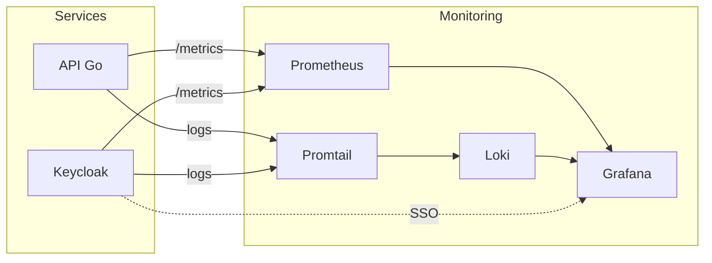

# Monitoring - Fast Pin Pon

## 🌐 Ports (Environnement DEV)

| Service        | Port | URL                      |
| -------------- | ---- | ------------------------ |
| **Frontend**   | 8080 | http://localhost:8080    |
| **API**        | 8081 | http://localhost:8081/v1 |
| **Keycloak**   | 8082 | http://localhost:8082    |
| **Grafana**    | 3000 | http://localhost:3000    |
| **Prometheus** | 9090 | http://localhost:9090    |

```bash
# Lancer le monitoring
docker compose -f docker-compose.dev.yml --profile monitoring up -d
```

---

## 📊 Stack Monitoring

| Composant      | Rôle                                             |
| -------------- | ------------------------------------------------ |
| **Prometheus** | Scrape les métriques `/metrics` toutes les 15s   |
| **Grafana**    | Dashboards de visualisation (SSO via Keycloak)   |
| **Loki**       | Stockage centralisé des logs                     |
| **Promtail**   | Agent qui collecte les logs et les pousse à Loki |

### Schéma



---

## 📈 Métriques Exposées

### HTTP (Standard)
- `api_http_requests_total` — Compteur de requêtes
- `api_http_request_duration_seconds` — Latence

### Métier (Custom)
- `api_intervention_assignment_travel_duration_seconds` — Temps de trajet
- `api_intervention_assignment_on_site_duration_seconds` — Temps sur site
- `api_event_resolution_duration_seconds` — Durée totale résolution
- `api_incident_heatmap` — Localisation incidents (heatmap géographique)

---

## 📂 Fichiers Clés

- `api/internal/server/metrics.go` — Métriques Prometheus  
- `infra/prometheus/prometheus.yml` — Config scraping
- `infra/promtail/promtail-config.yml` — Collecte logs
- `infra/grafana/dashboards/` — Dashboards JSON
