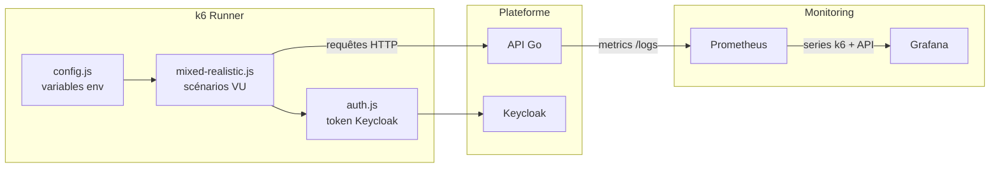

# Tests de charge k6 (version simple)

## Ce qu'il faut retenir

- k6 exécute du JavaScript (pas d'autre langage possible).
- Un Virtual User (VU) rejoue en boucle des requêtes HTTP avec des `sleep`.
- Les métriques peuvent être envoyées vers Prometheus pour être vues dans Grafana.

## Où sont les fichiers ?

```
infra/k6/
├── helpers/
│   ├── config.js      # URLs, variables d'env, coordonnées de Lyon
│   └── auth.js        # Récupère un token Keycloak + wrappers HTTP
└── scenarios/
    └── mixed-realistic.js   # Scénario principal (4 profils en même temps)
```

## Que fait le scénario `mixed-realistic.js` ?

- Dashboard : lit régulièrement /units, /events, /sync, /buildings (jusqu'à 50 VUs).
- Simulation : envoie des positions + télémetrie sur /units/{id} (jusqu'à 80 VUs).
- Routing : calcule des itinéraires via /routing/calculate (jusqu'à 15 VUs).
- Dispatch : consulte /dispatch/pending et les candidats (jusqu'à 15 VUs).

Pic total : environ 160 VUs pendant 4 minutes.

## Schéma du fonctionnement k6



## Lancer le test (workflow infra projet)

1) Démarrer l'infra de monitoring (Prometheus/Grafana) et les dépendances :
```bash
docker-compose -f docker-compose.dev.yml --profile monitoring up -d
```

2) Lancer k6 avec export Prometheus (utilise les scripts embarqués dans le conteneur k6) :
```bash
docker-compose -f docker-compose.dev.yml run --rm k6 \
  run --out experimental-prometheus-rw /scripts/scenarios/mixed-realistic.js
```

Variables attendues (peuvent être passées via `-e` si besoin) : `K6_API_URL`, `K6_KEYCLOAK_URL`, `K6_CLIENT_ID`, `K6_CLIENT_SECRET`.

## Comment lire le dashboard Grafana ?

Dashboard : k6 Performance Dashboard (http://localhost:3000)

- Overview : taux d'erreur, requêtes par seconde, VUs actifs.
- Latence : percentiles globaux et p95 par endpoint pour repérer les routes lentes.
- Débit : RPS par endpoint et erreurs par endpoint pour voir où ça casse.
- API Server : métriques Prometheus de l'API (latence côté serveur, RPS serveur).

## Optimisations proposées

- Index DB ciblés — voir api/migrations/018_performance_indexes.sql : réduit fortement les scans sur les requêtes fréquentes (events, routes, nearby).
- Cache en mémoire (TTL 60s) — voir api/internal/server/cache.go : évite de taper la base pour les données de référence, baisse la latence et la charge DB.

## Seuils de succès (thresholds k6)

- Taux d'erreur < 2 %
- p95 latence < 1000 ms
- p99 latence < 3000 ms
